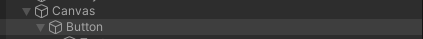

# Twitch Connection on Unity

Veja como fazer a integração da autorização e a autenticação da twitch em sua aplicação ou jogo criado na Unity.

## **Preparando os recursos e dependências**

Para iniciarmos, é preciso antes garantir que estamos com todas as etapas preparatorias foram executadas.

### **Cadastrar uma aplicação na Twitch**

É preciso realizar o cadastro da sua aplicação na Twitch. Para isto use os seguintes passos:

#### *Acesse o [console de desenvolvedor da Twitch](https://dev.twitch.tv/)*

#### *Se ainda não estiver logado no console, clique em [Log in with Twitch](https://dev.twitch.tv/login?next=https%3A%2F%2Fdev.twitch.tv%2F)*

#### *Se esta for a primeira vez que você acessa esta página, autorize o vínculo da conta a partir do botão 'Autorizar'*

#### *Já autenticado na pagina inicial da Twitch Developers, clique em [Your Console](https://dev.twitch.tv/console)*

#### *No console de desenvolvedor da Twitch, vá ate a aba [Applications](https://dev.twitch.tv/console/apps)*

#### *Nesta tela você irá visualizar todas suas aplicações registradas. Para registrar uma nova aplicação, clique em [+ Register your Application](https://dev.twitch.tv/console/apps/create)*

#### *Aqui você vai precisar informar o Nome, a(s) URL(s) de retorno do Token OAuth e a Categoria em que sua aplicação se enquadra. Cadastre os valores que você achar pertinente. Abaixo vamos descrever os valores utilizados neste treinamento:*

#### - ***Name**: TTVIntegrationWithUnity*

#### - ***OAuth** Redirect URLs: http://localhost:8919* (URL Padrão da biblioteca utilizada, depois você verá como customizá-la)

#### - ***Category**: Game Integration*

#### *Após preenchido os campos, clique em Create*

#### *Agora que foi redirecionado para a lista de Aplicações criadas, clique em "Manage" para a aplicação correspondente*

#### *Vá ao final da página e clique em "New Secret" e então clique em OK*

#### *Agora anote os valores do seu 'Cient ID' e também do seu 'Client Secret' (Anote em um local seguro. Assim que você fechar esta página, não terá mais onde obter o valor de Client Secret gerado, te obrigando a gerar um novo. Assim todas aplicações que usavam seu Secret antigo deixariam de funcionar.)*

#### **Baixar e Compilar a biblioteca *StreamingClientLibrary***

Neste treinamento, será utilizado a biblioteca [StreamingClientLibrary](https://github.com/SaviorXTanren/StreamingClientLibrary) desenvolvida por [Matthew Olivo](https://github.com/SaviorXTanren), um mero desenvolvedor do time do XBOX na microsoft, e também um dos fundadores e lider de desenvolvimento do Mixitup, um BOT para a Mixer e que foi migrado (em apenas uma noite) para a Twitch após o encerramento de suas atividades.

Como usaremos esta biblioteca na Unity, a utilização de pacotes Nuget não auxiliam muito, por isto a abordagem será a de baixar os codigos fontes atualizados, compilar a biblioteca em uma unica DLL, e então utilizar ela na sua aplicação Unity.

#### *Baixe o código fonte atualizado da [biblioteca StreamingClientLibrary](https://github.com/SaviorXTanren/StreamingClientLibrary/archive/refs/heads/master.zip)*

#### *Descompacte os arquivos em algum diretório de sua escolha*

#### *Navegue até a pasta onde você extraiu os arquivos, e então clicando com o botão direito  na pasta "StreamingClient.Base" clique em "Abrir no terminal do Windows"*

#### *Execute o comando 'dotnet publish Twitch\Twitch.Base'*

#### *Pronto, na pasta Twitch\Twitch.Base\bin\Debug\netstandard2.0\publish haverá a DLL e suas dependências que iremos utilizar na Unity*

## **Criando a autorização Twitch na Unity**

Crie um novo projeto ou utilize um já existente a qual queira adicionar a integração da Twitch utilizando a biblioteca StreamingClientLibrary.

#### *O primeiro passo e arrastar ou colar somente as DLLs StreamingClient.Base.dll e a Twitch.Base.dll que foram compilada anteriormente para a pasta Assets do seu projeto Unity*

#### *Dentro da pasta Assets crie uma nova pasta chamada Integrations*

#### *Agora dentro desta pasta, adicione um novo script chamado 'TwitchIntegration'. Esta sera uma classe de integração com a Twitch, portanto será consumida por outras controllers, portanto não irá herdar a MonoBehaviour*

### **Codificando a TwitchIntegration.cs**

Inicialmente, limpe a classe gerada pela unity, removendo a herança de Game Object, remova os metodos Start() e Update() e por uma boa prática, envolva a classe dentro de um namespace com o mesmo nome da pasta em que esta contida: 'Integrations' e por fim torne a classe Estatica, visto que havera apenas uma unica conexão com a twitch por vez em todo ciclo de vida do seu projeto.

```
namespace Integrations
{
    public static class TwitchIntegration
    {
  
    }
}
```

Agora vamos declarar todas as constantes, que serão as propriedades imutáveis após a compilação do projeto. Para isto, tenha em mãos aquelas chaves que a Twitch gerou no console de desenvolvimento que foi solicitado que fosse armazenado em lugar seguro. Estes valores serão preenchidos nas constantes ClientID e ClientSecret.
Quanto a constante SuccessResponseHTMLBody você pode depois customizar ela ao seu gosto, ela será o conteúdo que irá aparecer no navegador assim que a autorização com a twitch for bem sucedida.
Quanto a constante SuccesRedirectURL, veja que ela é a mesma URL que você cadastrou no console de desenvolvimento da Twitch. Ou seja, se for personalizar esta URL, você também precisa configurar a respectiva URL neste painel.
Já a constante AuthorizationScopes ela dita sobre que permissões de acesso estamos requisitando para o usuário da twitch que está se conectando no momento. Dependendo dos serviços consumidos, precisamos solicitar escopos diferentes, mas por ora partiremos apenas de ler dados do usuário logado.

```
const string ClientID = "qbuvvgggk6tev6bonpvswxk8e4e6uc";
const string ClientSecret = "bo85843vcdgrd78o4x7w4qj446ojyj";
const string SuccessResponseHTMLBody = "<html><body>Você esta logado. Pode fechar esta página agora.<body></html>";
const string TwitchAuthBaseURL = "https://id.twitch.tv/oauth2/authorize";
const string SuccesRedirectURL = "http://localhost:8919";
const string AuthorizationScopes = "user:read:email";
```

Depois das constantes, vamos declarar todas a propriedades somente leitura, que serão preenchidas somente pela própria classe de integração com a Twitch, mas que você podera consumir fora dela:

- AuthorizationCode: O Token de autenticação OAuth que sera utilizado nas chamadas da API da Twitch.
- IsAuthorizing: Indica se o processo esta em fase de autorização
- IsAuthorized: Indica se o processo de autorização foi concluído e que já temos o acesso de consulta da API liberado
- IsConnecting: Indica se o processo de conexão com a Twitch está em andamento
- IsConnected: Indica se o processo de conexão foi executado com sucesso
- CurrentUser: Objeto que contem dados do usuário da twitch que logou na aplicação
- CurrentChannel: Objeto que contem informações do canal do usuário da twitch que logou na a plicação

```
public static string AuthorizationCode { get; private set; }
public static bool IsAuthorizing { get; private set; }
public static bool IsAuthorized { get; private set; }
public static bool IsConnecting { get; private set; }
public static bool IsConnected { get; private set; }
public static UserModel CurrentUser { get; private set; }
public static ChannelInformationModel CurrentChannel { get; private set;}
```

Como as conexões são assincronas e orientada a eventos, vamos declarar os delegates e seus respectivos eventos

```
public delegate void TwitchConnectionHandler();
public delegate void TwitchConnectionSuccessHandler(UserModel currentUser, ChannelInformationModel currentChannel);

public static event TwitchConnectionHandler OnTwitchConnecting;
public static event TwitchConnectionHandler OnTwitchDisconnected;
public static event TwitchConnectionHandler OnTwitchConnectFail;
public static event TwitchConnectionSuccessHandler OnTwitchConnected;
```

Temos a seguir a declaração dos objetos privados, que manterão a conexão e a autenticação

´´´
private static OAuthTokenModel oauthModel;
private static TwitchConnection connection;
´´´

Precisamos de um metodo agora, que receba uma conexão twitch, e controle se ela é nova. Se afirmativo, cria uma copia do seu token para futura requisição e dispara o evento de conexão

```
private static void SetNewConnection(TwitchConnection twitchConnection)
{
    if (twitchConnection != null && connection != twitchConnection)
    {
        connection = twitchConnection;
        oauthModel = connection.GetOAuthTokenCopy();
          
        if (!IsConnected && CurrentUser != null)
        {
            IsConnected = true;
            OnTwitchConnected?.Invoke(CurrentUser, CurrentChannel);
        }
    }
}
```

O metodo acima, será utilizado pelo seguinte metodo, que irá controlar as conexões existentes, renovando seu token de acesso quando preciso.

``````
private static async Task<TwitchConnection> GetConnectionAsync()
{
    try
    {
        if (oauthModel != null && oauthModel.ExpirationDateTime > DateTime.Now)
            return connection;

        if (oauthModel != null && (oauthModel.ExpirationDateTime <= DateTime.Now))
            SetNewConnection(await TwitchConnection.ConnectViaOAuthToken(oauthModel));

        if (oauthModel == null && !string.IsNullOrEmpty(AuthorizationCode))
        {
            var newConnection = await TwitchConnection.ConnectViaAuthorizationCode(ClientID, ClientSecret, AuthorizationCode, redirectUrl: SuccesRedirectURL);
            SetNewConnection(newConnection);
        }
    }
    catch (Exception ex)
    {
        connection = null;
        oauthModel = null;
        UnityEngine.Debug.LogError(ex.Message);
        if (IsConnected)
        {
            IsConnected = false;
            OnTwitchDisconnected?.Invoke();
        }
        else
        {
            OnTwitchConnectFail?.Invoke();
        }
    }
    return connection;
}
``````

Agora vamos criar o método que irá receber um *HttpListenerContext* e processar o seu conteúdo para obter o token retornado pela Twitch e então renderizar o HTML da constante *SuccessResponseHTMLBody* no navegador que foi aberto.

```
private static async Task ProcessConnection(HttpListenerContext listenerContext)
{
    HttpStatusCode statusCode = HttpStatusCode.Unauthorized;
    string result = string.Empty;

    string token = HttpUtility.ParseQueryString(listenerContext.Request.Url.Query).Get("code");
    if (!string.IsNullOrEmpty(token))
    {
        statusCode = HttpStatusCode.OK;
        result = SuccessResponseHTMLBody;
        AuthorizationCode = token;
    }

    listenerContext.Response.Headers["Access-Control-Allow-Origin"] = "*";
    listenerContext.Response.StatusCode = (int)statusCode;
    listenerContext.Response.StatusDescription = statusCode.ToString();

    byte[] buffer = Encoding.UTF8.GetBytes(result);
    await listenerContext.Response.OutputStream.WriteAsync(buffer, 0, buffer.Length);
}
```

E por fim, o principal metodo, que será utilizado pela sua aplicação para solicitar uma autorização e conexão com a Twitch:

```
public static async void Authorize()
{
    IsAuthorizing = true;
    OnTwitchConnecting?.Invoke();
    var httpListener = new HttpListener();
    try
    {
        Dictionary<string, string> parameters = new Dictionary<string, string>()
        {
            { "client_id", ClientID },
            { "redirect_uri", SuccesRedirectURL },
            { "response_type", "code" },
            { "scope", AuthorizationScopes}
        };

        FormUrlEncodedContent content = new FormUrlEncodedContent(parameters.AsEnumerable());

        string twitchAuthURL = $"{TwitchAuthBaseURL}?{await content.ReadAsStringAsync()}";

        httpListener.AuthenticationSchemes = AuthenticationSchemes.Anonymous;
        httpListener.Prefixes.Add(SuccesRedirectURL + "/");
        //Iniciando um Servidor HTTP para receber a resposta da Twitch
        httpListener.Start();

        ProcessStartInfo startInfo = new ProcessStartInfo() { FileName = twitchAuthURL, UseShellExecute = true };
        //Abrindo a página de autenticação da Twitch no navegador padrão
        //para que o usuário da twitch possa autorizar a aplicação
        Process.Start(startInfo);

        await Task.Factory.StartNew(async () =>
        {
            while (httpListener != null && httpListener.IsListening)
            {
                HttpListenerContext context = httpListener.GetContext();

                if (httpListener.IsListening)
                    await ProcessConnection(context);

                IsAuthorized = context.Response.StatusCode == (int)HttpStatusCode.OK;
            }
        }, TaskCreationOptions.LongRunning);


        var con = await GetConnectionAsync();
        CurrentUser = await con?.NewAPI.Users.GetCurrentUser();
        if (CurrentUser != null && CurrentUser.id != null)
            CurrentChannel = await con?.NewAPI.Channels.GetChannelInformation(CurrentUser);
        else 
            throw new Exception("Unknow error when get current twitch user");
    }
    catch (Exception ex)
    {
        OnTwitchConnectFail?.Invoke();
        UnityEngine.Debug.LogException(ex);
    }

    httpListener.Stop();
    IsAuthorizing = false;

    if (!IsConnected && CurrentUser != null)
    {
        IsConnected = true;
        OnTwitchConnected?.Invoke(CurrentUser, CurrentChannel);
    }
}
```

## **Criando a controller de conexão da Twitch na Unity**

#### *Dentro da pasta Assets crie uma nova pasta chamada Controllers*

#### *Dentro da pasta Controllers, crie uma nova pasta chamada TwitchAPI*

#### *Agora dentro desta pasta, adicione um novo script chamado 'TwitchController'. Esta sera um MonoBehaviour que irá se conectar com a twitch*

### **Codificando a TwitchController.cs**

Inicialmente, limpe a classe gerada pela unity, removendo os metodos Start() e Update().
Por boa prática, envolva a classe com o namespace seguindo a estrutura de pastas criadas:

``````
using UnityEngine;

namespace Controllers.TwitchAPI
{
}
``````

Agora adicione os metodos OnEnable() e OnDisable(), que servirão para a registrar os eventos assim que o objeto vor iniciado, e desfazer o registro dos eventos assim que a classe for disposta ou desabilitada.

```
public void OnEnable()
{
    //Register events
    Integrations.TwitchIntegration.OnTwitchConnecting += TwitchIntegration_OnTwitchConnecting;
    Integrations.TwitchIntegration.OnTwitchConnectFail += TwitchIntegration_OnTwitchConnectFail;
    Integrations.TwitchIntegration.OnTwitchConnected += TwitchIntegration_OnTwitchConnected;
    Integrations.TwitchIntegration.OnTwitchDisconnected += TwitchIntegration_OnTwitchDisconnected;
}

public void OnDisable()
{
    //Unregister events
    Integrations.TwitchIntegration.OnTwitchConnecting -= TwitchIntegration_OnTwitchConnecting;
    Integrations.TwitchIntegration.OnTwitchConnectFail -= TwitchIntegration_OnTwitchConnectFail;
    Integrations.TwitchIntegration.OnTwitchConnected -= TwitchIntegration_OnTwitchConnected;
    Integrations.TwitchIntegration.OnTwitchDisconnected -= TwitchIntegration_OnTwitchDisconnected;
}
```

Agora precisamos criar os metodos registrados nos eventos acima

```
private void TwitchIntegration_OnTwitchDisconnected()
{
    #if DEBUG
        Debug.Log("Twitch is disconnected");
    #endif
    //Put here your twitch disconnection logic
}

private void TwitchIntegration_OnTwitchConnected(Twitch.Base.Models.NewAPI.Users.UserModel currentUser, Twitch.Base.Models.NewAPI.Channels.ChannelInformationModel currentChannel)
{
    #if DEBUG
        Debug.Log("Twitch connection sucessfull");
        Debug.Log($"UserLogin:{currentUser.login};UserDisplayName:{currentUser.display_name};UserEmail:{currentUser.email}");
        Debug.Log($"ChannelLanguage:{currentChannel.broadcaster_language};ChannelGame:{currentChannel.game_name};ChannelTitle:{currentChannel.title}");
    #endif
    //Put here your twitch connected logic
}

private void TwitchIntegration_OnTwitchConnectFail()
{
    #if DEBUG
        Debug.Log("Twitch connection failed");
    #endif
    //Put here your twitch connection fail logic
}

private void TwitchIntegration_OnTwitchConnecting()
{
    #if DEBUG
        Debug.Log("Twitch start connection process");
    #endif
    //Put here your twitch connecting logic
}
```

E por fim, vamos criar o metodo que ira chamar a conexão com a Twitch.

```
public void Connect()
    => Integrations.TwitchIntegration.Authorize();
```

Este metodo poderá ser chamado por qualquer outro objeto ou ate mesmo por um evento de algum GameObject como um clique de um botão que e o que veremos na próxima etapa.

## **Criando um botão na cena**

Estes passos serao realizados na Unity

#### *Na sua cena, crie um Canvas, e dentro deste canvas, um Botão*

#### *No canvas, adicione como componente o script TwitchController*

#### *No botão, Adicione um evento OnClic, movendo o Canvas como objeto, e selecionando o metodo TwitchController.Connect*




## **Finalizando**
Pronto, antes de rodar sua aplicação, confirme se você alterou as constantes ClientID e ClientSecret para as que você criou no console de desenvolvimento da Twitch. Após isto, ao rodar a aplicação, você será redirecionado para uma página de autorização da twitch, e confirmando o acesso, a aplicação irá se conectar e exibir os dados do seu usuário no console da unity.


