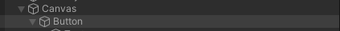
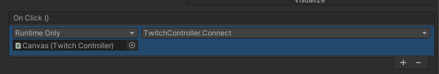
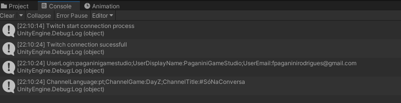

# Twitch Connection on Unity

See how to integrate twitch authorization and authentication into your Unity game or app.

## **Preparing resources and dependencies**

At first, we must ensure that we have check all the preparatory steps.

### **Register an app on Twitch**

You must register your application on Twitch. For this use the following steps:

 *Go to [Twitch developer console](https://dev.twitch.tv/)*

 *If you aren't already logged into the console, click on [Log in with Twitch](https://dev.twitch.tv/login?next=https%3A%2F%2Fdev.twitch.tv%2F)*

 *If this is the first time you access this page, authorize the account link from the button 'Authorize'*

 *Once authenticated on the Twitch Developers homepage, click on [Your Console](https://dev.twitch.tv/console)*

 *In the Twitch developer console, go to the tab [Applications](https://dev.twitch.tv/console/apps)*

 *On this screen you will see all your registered applications. To register a new application, click on [+ Register your Application](https://dev.twitch.tv/console/apps/create)*

 *Here you will need to complete the Name, OAuth Token return URL(s) and the Category that represent the kind of application are registered. Enter the values ??that you think are relevant. Below we describe the values we ??used in this training:*

 - ***Name**: TTVIntegrationWithUnity*

 - ***OAuth** Redirect URLs: http://localhost:8919* (Default URL of the library, later you will see how to customize it)
 - ***Category**: Game Integration*

 *After complete the fields, click on Create**

 *Now that you have been redirected to the list of created applications, click on "Manage" for the corresponding application*

 *Go to the bottom of the page and click in the "New Secret" button and then click OK*

 *Now save your 'Cient ID' and 'Client Secret' values for a future use (Save this in a safe place. Once you close this page, you will no longer see your Client Secret, forcing you to generate a new . Then all applications that used your old Secret would stop working.)*

 **Download and Compile the library *StreamingClientLibrary***

On this training, we use the [StreamingClientLibrary](https://github.com/SaviorXTanren/StreamingClientLibrary) library, developed by [Matthew Olivo](https://github.com/SaviorXTanren), a mere XBOX team developer at microsoft, and also one of the Mixitup founders and development leader, a robust Mixer BOT that was migrated (in only one night) to Twitch after the end of Mixer activities.

As we will be using this library in Unity, the use of Nuget packages does not help much, so the approach will be to download the updated source codes, compile the library into a single DLL, and then use it in your Unity application.

 *Download the updated source code from [biblioteca StreamingClientLibrary](https://github.com/SaviorXTanren/StreamingClientLibrary/archive/refs/heads/master.zip)*

 *Unzip the files in any directory of your choice*

 *Navigate to the folder where you extracted the files, then right-click the "StreamingClient.Base" folder and click on "Open in Windows Terminal"*

 *Run the command 'dotnet publish Twitch\Twitch.Base'*

 *Okay, in the folder Twitch\Twitch.Base\bin\Debug\netstandard2.0\publish there will be the DLL and its dependencies that we will use in Unity*

## **Craft Twitch authorization in Unity**

Create a new project or use an existing one to add Twitch integration whith StreamingClientLibrary library.

 *The first step is to drag or paste the StreamingClient.Base.dll and Twitch.Base.dll DLLs that were previously compiled to the Assets folder of your Unity project*

 *Inside the Assets folder create a new folder called Integrations*

 *Now inside this folder, add a new script called 'TwitchIntegration'. This will be a static Twitch integration class, so it will be consumed by other controllers, so it won't inherit MonoBehaviour*

### **Coding TwitchIntegration.cs**

Initially, clean the class generated by unity, removing the MonoBehaviour inheritance, remove the Start() and Update() methods and as a good practice, wrap the class inside a namespace with the same name as the folder in which it is contained: 'Integrations' and finally make the class Static, as there will only be a single connection to twitch at a time throughout your project's lifecycle.

```
namespace Integrations
{
    public static class TwitchIntegration
    {
  
    }
}
```

Now let's declare all the constants, which will be the immutable properties after the project is compiled. For this, have in hand those keys that Twitch generated in the development console that was requested to be stored in a safe place. These values ??will be filled in the ClientID and ClientSecret constants.
As for the SuccessResponseHTMLBody constant you can customize it, this value will be an HTML content that will appear on the browser once the authorization with twitch is successful.
As for the SuccesRedirectURL constant, note that it is the same URL you registered in the Twitch dev console. That is, if you are going to customize this URL, you also need to configure the respective URL in this panel.
The AuthorizationScopes constant dictates what access permissions we are requesting for the twitch user who is currently connecting. Depending on the services consumed, we need to request different scopes, but for now we will just start reading data from the logged in user.

```
const string ClientID = "qbuvvgggk6tev6bonpvswxk8e4e6uc";
const string ClientSecret = "bo85843vcdgrd78o4x7w4qj446ojyj";
const string SuccessResponseHTMLBody = "<html><body>Please close this window.<body></html>";
const string TwitchAuthBaseURL = "https://id.twitch.tv/oauth2/authorize";
const string SuccesRedirectURL = "http://localhost:8919";
const string AuthorizationScopes = "user:read:email";
```

After the constants, let's declare all the read-only properties, which will only be filled by the Twitch integration class itself, but which you can consume outside of it:

- AuthorizationCode: The OAuth Authentication Token that will be used in Twitch API calls.
- IsAuthorizing: Indicates whether the process is in the authorization phase
- IsAuthorized: Indicates whether the authorization process has completed and that we already have API query access released
- IsConnecting: Indicates whether the Twitch connection process is in progress
- IsConnected: Indicates whether the connection process was successful
- CurrentUser: Object that contains data from the twitch user who logged into the application
- CurrentChannel: Object that contains information about the twitch user's channel who logged into the application

```
public static string AuthorizationCode { get; private set; }
public static bool IsAuthorizing { get; private set; }
public static bool IsAuthorized { get; private set; }
public static bool IsConnecting { get; private set; }
public static bool IsConnected { get; private set; }
public static UserModel CurrentUser { get; private set; }
public static ChannelInformationModel CurrentChannel { get; private set;}
```

As the connections are asynchronous and event driven, let's declare the delegates and their respective events

```
public delegate void TwitchConnectionHandler();
public delegate void TwitchConnectionSuccessHandler(UserModel currentUser, ChannelInformationModel currentChannel);

public static event TwitchConnectionHandler OnTwitchConnecting;
public static event TwitchConnectionHandler OnTwitchDisconnected;
public static event TwitchConnectionHandler OnTwitchConnectFail;
public static event TwitchConnectionSuccessHandler OnTwitchConnected;
```

Next we have the declaration of the private objects, which will maintain the connection and authentication

``````
private static OAuthTokenModel oauthModel;
private static TwitchConnection connection;
``````

We need a method that receives a twitch connection, and checks if it's new. If so, create a copy of your token for future request and trigger the connection event

```
private static void SetNewConnection(TwitchConnection twitchConnection)
{
    if (twitchConnection != null && connection != twitchConnection)
    {
        connection = twitchConnection;
        oauthModel = connection.GetOAuthTokenCopy();
          
        if (!IsConnected && CurrentUser != null)
        {
            IsConnected = true;
            OnTwitchConnected?.Invoke(CurrentUser, CurrentChannel);
        }
    }
}
```

The above method will be used by the following method, which will control existing connections, renewing your access token when needed.

``````
private static async Task<TwitchConnection> GetConnectionAsync()
{
    try
    {
        if (oauthModel != null && oauthModel.ExpirationDateTime > DateTime.Now)
            return connection;

        if (oauthModel != null && (oauthModel.ExpirationDateTime <= DateTime.Now))
            SetNewConnection(await TwitchConnection.ConnectViaOAuthToken(oauthModel));

        if (oauthModel == null && !string.IsNullOrEmpty(AuthorizationCode))
        {
            var newConnection = await TwitchConnection.ConnectViaAuthorizationCode(ClientID, ClientSecret, AuthorizationCode, redirectUrl: SuccesRedirectURL);
            SetNewConnection(newConnection);
        }
    }
    catch (Exception ex)
    {
        connection = null;
        oauthModel = null;
        UnityEngine.Debug.LogError(ex.Message);
        if (IsConnected)
        {
            IsConnected = false;
            OnTwitchDisconnected?.Invoke();
        }
        else
        {
            OnTwitchConnectFail?.Invoke();
        }
    }
    return connection;
}
``````

Now let's create the method that will receive a *HttpListenerContext* and process its content to get the token returned by Twitch and then render the HTML of the constant *SuccessResponseHTMLBody* in the browser that was opened.

```
private static async Task ProcessConnection(HttpListenerContext listenerContext)
{
    HttpStatusCode statusCode = HttpStatusCode.Unauthorized;
    string result = string.Empty;

    string token = HttpUtility.ParseQueryString(listenerContext.Request.Url.Query).Get("code");
    if (!string.IsNullOrEmpty(token))
    {
        statusCode = HttpStatusCode.OK;
        result = SuccessResponseHTMLBody;
        AuthorizationCode = token;
    }

    listenerContext.Response.Headers["Access-Control-Allow-Origin"] = "*";
    listenerContext.Response.StatusCode = (int)statusCode;
    listenerContext.Response.StatusDescription = statusCode.ToString();

    byte[] buffer = Encoding.UTF8.GetBytes(result);
    await listenerContext.Response.OutputStream.WriteAsync(buffer, 0, buffer.Length);
}
```

And finally, the main method, which will be used by your application to request authorization and connection with Twitch:

```
public static async void Authorize()
{
    IsAuthorizing = true;
    OnTwitchConnecting?.Invoke();
    var httpListener = new HttpListener();
    try
    {
        Dictionary<string, string> parameters = new Dictionary<string, string>()
        {
            { "client_id", ClientID },
            { "redirect_uri", SuccesRedirectURL },
            { "response_type", "code" },
            { "scope", AuthorizationScopes}
        };

        FormUrlEncodedContent content = new FormUrlEncodedContent(parameters.AsEnumerable());

        string twitchAuthURL = $"{TwitchAuthBaseURL}?{await content.ReadAsStringAsync()}";

        httpListener.AuthenticationSchemes = AuthenticationSchemes.Anonymous;
        httpListener.Prefixes.Add(SuccesRedirectURL + "/");
        //Iniciando um Servidor HTTP para receber a resposta da Twitch
        httpListener.Start();

        ProcessStartInfo startInfo = new ProcessStartInfo() { FileName = twitchAuthURL, UseShellExecute = true };
        //Abrindo a página de autenticação da Twitch no navegador padrão
        //para que o usuário da twitch possa autorizar a aplicação
        Process.Start(startInfo);

        await Task.Factory.StartNew(async () =>
        {
            while (httpListener != null && httpListener.IsListening)
            {
                HttpListenerContext context = httpListener.GetContext();

                if (httpListener.IsListening)
                    await ProcessConnection(context);

                IsAuthorized = context.Response.StatusCode == (int)HttpStatusCode.OK;
            }
        }, TaskCreationOptions.LongRunning);


        var con = await GetConnectionAsync();
        CurrentUser = await con?.NewAPI.Users.GetCurrentUser();
        if (CurrentUser != null && CurrentUser.id != null)
            CurrentChannel = await con?.NewAPI.Channels.GetChannelInformation(CurrentUser);
        else 
            throw new Exception("Unknow error when get current twitch user");
    }
    catch (Exception ex)
    {
        OnTwitchConnectFail?.Invoke();
        UnityEngine.Debug.LogException(ex);
    }

    httpListener.Stop();
    IsAuthorizing = false;

    if (!IsConnected && CurrentUser != null)
    {
        IsConnected = true;
        OnTwitchConnected?.Invoke(CurrentUser, CurrentChannel);
    }
}
```

## **Creating the Twitch Connection Controller in Unity**

 *Inside the Assets folder create a new folder called Controllers*

 *Inside the Controllers folder, create a new folder called TwitchAPI*

 *Now inside this folder, add a new script called 'TwitchController'. This will be a MonoBehaviour that will connect to twitch*

### **Coding TwitchController.cs**

Initially, clean up the class generated by unity, removing the Start() and Update() methods.
As a good practice, wrap the class with the namespace following the created folder structure:

``````
using UnityEngine;

namespace Controllers.TwitchAPI
{
}
``````

Now add the OnEnable() and OnDisable() methods, which will be used to register the events as soon as the object is started, and unregister the events as soon as the class is disposed or disabled.


```
public void OnEnable()
{
    //Register events
    Integrations.TwitchIntegration.OnTwitchConnecting += TwitchIntegration_OnTwitchConnecting;
    Integrations.TwitchIntegration.OnTwitchConnectFail += TwitchIntegration_OnTwitchConnectFail;
    Integrations.TwitchIntegration.OnTwitchConnected += TwitchIntegration_OnTwitchConnected;
    Integrations.TwitchIntegration.OnTwitchDisconnected += TwitchIntegration_OnTwitchDisconnected;
}

public void OnDisable()
{
    //Unregister events
    Integrations.TwitchIntegration.OnTwitchConnecting -= TwitchIntegration_OnTwitchConnecting;
    Integrations.TwitchIntegration.OnTwitchConnectFail -= TwitchIntegration_OnTwitchConnectFail;
    Integrations.TwitchIntegration.OnTwitchConnected -= TwitchIntegration_OnTwitchConnected;
    Integrations.TwitchIntegration.OnTwitchDisconnected -= TwitchIntegration_OnTwitchDisconnected;
}
```

Now we need to create the methods registered in the events above

```
private void TwitchIntegration_OnTwitchDisconnected()
{
    #if DEBUG
        Debug.Log("Twitch is disconnected");
    #endif
    //Put here your twitch disconnection logic
}

private void TwitchIntegration_OnTwitchConnected(Twitch.Base.Models.NewAPI.Users.UserModel currentUser, Twitch.Base.Models.NewAPI.Channels.ChannelInformationModel currentChannel)
{
    #if DEBUG
        Debug.Log("Twitch connection sucessfull");
        Debug.Log($"UserLogin:{currentUser.login};UserDisplayName:{currentUser.display_name};UserEmail:{currentUser.email}");
        Debug.Log($"ChannelLanguage:{currentChannel.broadcaster_language};ChannelGame:{currentChannel.game_name};ChannelTitle:{currentChannel.title}");
    #endif
    //Put here your twitch connected logic
}

private void TwitchIntegration_OnTwitchConnectFail()
{
    #if DEBUG
        Debug.Log("Twitch connection failed");
    #endif
    //Put here your twitch connection fail logic
}

private void TwitchIntegration_OnTwitchConnecting()
{
    #if DEBUG
        Debug.Log("Twitch start connection process");
    #endif
    //Put here your twitch connecting logic
}
```

E por fim, vamos criar o metodo que ira chamar a conexão com a Twitch.

```
public void Connect()
    => Integrations.TwitchIntegration.Authorize();
```

This method can be called by any other object or even by an event of some GameObject like a button click which is what we will see in the next step.

## **Creating a button in the scene**

These steps will be performed in Unity

 *In your scene, create a Canvas, and inside this canvas, a Button*

 *On the canvas, add the TwitchController script as a component*

 *On the button, Add an OnClick event, moving the Canvas as an object, and selecting the TwitchController.Connect method*





## **Finishing**
Okay, before running your application, confirm that you have changed the ClientID and ClientSecret constants to the ones you created in the Twitch development console. After that, when running the application, you will be redirected to a twitch authorization page to request user access, the application will connect and display your user data in the unity console.


